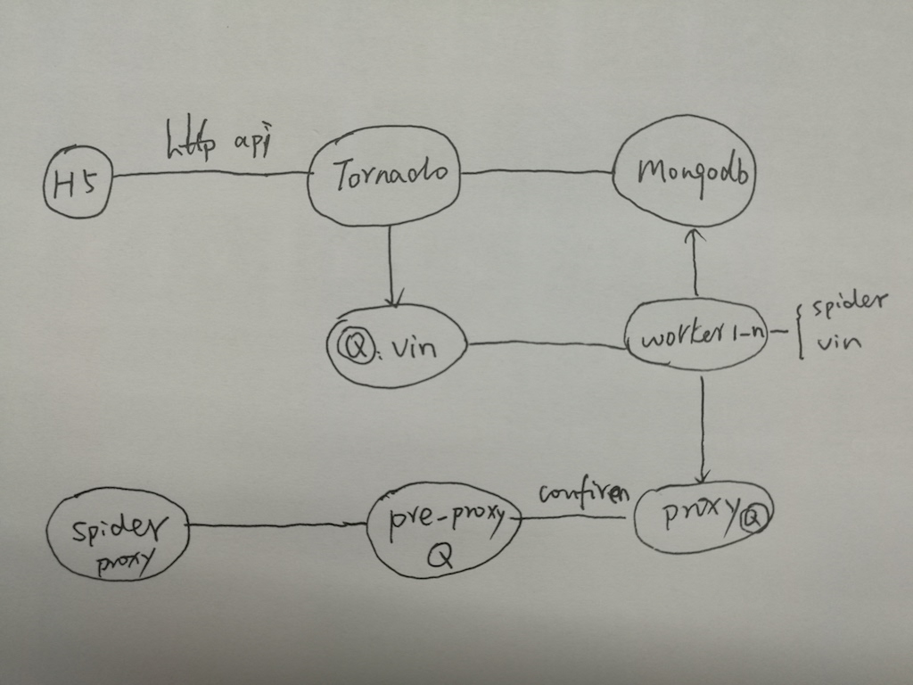

# vin-decoder

车架号(车辆识别码)查询服务/校验服务

## vin layout
The 17 character VIN:

<table border="1">
<tbody><tr><th colspan="4">VIN</th></tr>
<tr id="txtbb">
<td> Position</td>
<td> ISO Section</td>
<td> 49 CFR 565</td>
<td> Assigned by</td>
</tr>
<tr><th colspan="4"></th></tr>
<tr>
<td id="txtbb"> 1 - 2</td>
<td rowspan="2"> WMI</td>
<td> Country Code</td>
<td rowspan="2"> SAE</td>
</tr>
<tr>
<td id="txtbb"> 2 - 3</td>
<td> Manufacturer, Type of MV</td>
</tr>
<tr><th colspan="4"></th></tr>
<tr>
<td id="txtbb"> 4 - 8</td>
<td> VDS</td>
<td> Vehicle Attributes</td>
<td> Manufacturer</td>
</tr>
<tr><th colspan="4"></th></tr>
<tr>
<td id="txtbb"> 9</td>
<td rowspan="5"> VIS</td>
<td> Check Digit</td>
<td> Calculated</td>
</tr>
<tr><th></th>
<th colspan="2"></th></tr>
<tr>
<td id="txtbb"> 10</td>
<td> Model Year</td>
<td> 30 Year Code</td>
</tr>
<tr>
<td id="txtbb"> 11</td>
<td> Manufacturing Plant</td>
<td rowspan="2"> Manufacturer</td>
</tr>
<tr>
<td id="txtbb"> 12 - 17</td>
<td> Serial Number</td>
</tr>
<tr><th colspan="4"> Or &lt; 500 models per year</th></tr>
<tr>
<td id="txtbb"> 9</td>
<td rowspan="6"> VIS</td>
<td> Check Digit</td>
<td> Calculated</td>
</tr><tr><th></th>
<th colspan="2"></th>
</tr>
<tr>
<td id="txtbb"> 10</td>
<td> Model Year</td>
<td> 30 Year Code</td>
</tr>
<tr>
<td id="txtbb"> 11</td>
<td> Manufacturing Plant</td>
<td> Manufacturer</td>
</tr>
<tr>
<td id="txtbb"> 12 - 14</td>
<td> WMI Suffix</td>
<td> SAE</td>
</tr>
<tr>
<td id="txtbb"> 15 - 17</td>
<td> Serial Number</td>
<td> Manufacturer</td>
</tr>
</tbody></table>


## 使用方法
提供web查询服务

* 查询vin
  * http://127.0.0.1/vin/v1/LVSHCAMB1CE054249
* 查询wmi
  * http://127.0.0.1/wmi/v1/LSV
* 验证vin
  * http://127.0.0.1/vin/v1/checksum/LVSHCAMB1CE054249

请求
```shell
curl http://127.0.0.1/vin/v1/LVSHCAMB1CE054249
```

响应
```josn
{
  "status": "20000000",
  "message": "ok",
  "result": [{
    "vincode": "LVSHCAMB",
    "驱动形式": "前置前驱",
    "排量(升)": "1.6 L",
    "进气形式": "自然吸气",
    "变速器描述": "手动变速器(MT)",
    "燃油类型": "汽油",
    "品牌": "福特",
    "最大马力(ps)": "125",
    "厂家": "长安福特马自达",
    "VIN年份": "2012",
    "档位数": "5",
    "车型": "福克斯-两厢",
    "排放标准": "国4"
  }]
}
```
## 技术栈

* Python
* Tornado
* Mongodb

## 正确性校验服务
从组成规则验证vin是否合法

 * 只包含阿拉伯数字和罗马字母(字母I,O,Q不能使用)
 * 校验码验证

## Mongodb文档

* WMI
  * 判断是否为欧版还是美版
  * [WMI Region](https://en.wikibooks.org/wiki/Vehicle_Identification_Numbers_(VIN_codes)/World_Manufacturer_Identifier_(WMI))
* WMI+VDS
  * 美版(中国)，包含校验码，需要忽略
  * 欧版，没有校验码
* YEAR
  * 年份代码表（30年循环一次）

## 数据来源
一次获取，多次使用（Mongodb缓存数据）

* 付费查询
  * 网页解析
* 网络爬虫
  * 定时更新 

## 系统架构
系统主要依赖两个组件

* mongodb
* rabbitmq

mongodb实现了无模式，非常适合存储网络爬取到的数据，rabbitmq降低了多个模块的耦合性。



## RabbitMQ
系统包含了多个队列，这里做一个统一说明

* vin
  * 需要查询的vin code
* pre-proxy
  * 爬虫获取到的代理服务器
* proxy
  * 经过简单验证的代理服务器

## Spider
包含了两种爬虫

* 代理网站
  * http://31f.cn/
  * http://www.kuaidaili.com/
  * http://www.66ip.cn/

* vin查询网站
  * [www.vin114.net](http://www.vin114.net)
  * [www.vincar.cn](http://www.vincar.cn)
